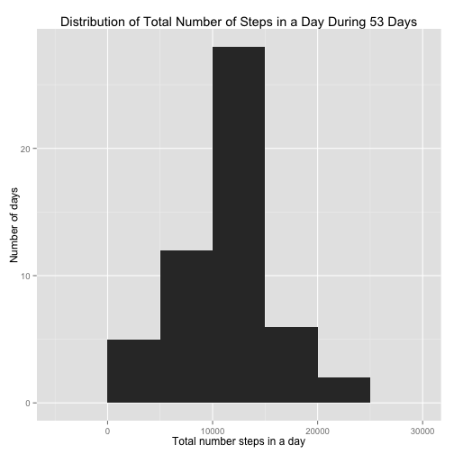
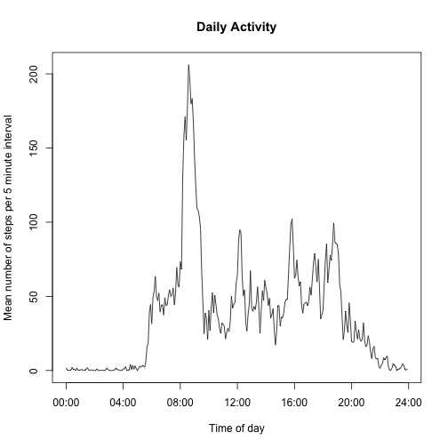
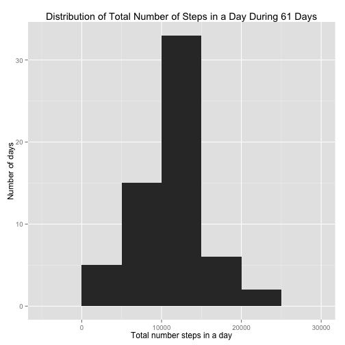
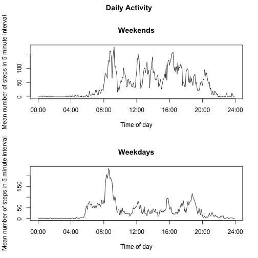

# Reproducible Research: Peer Assessment 1

========================================================


This project undertakes an exploratory analysis of activity monitoring data collected on a subject during the 61 days of October and November 2012. There is one case in the data set for every 5 minute interval during the 61 days, thus giving 

(12 cases/hour)x(24 hours/day)x(61 days) = (12)(24)(61) = 17,568 cases.

For each of these 5-minute intervals the data collected consists of:

* date: the date of the 5-minute interval
* interval: an variable giving when during the day the 5-minute interval begins
* steps: the number of steps subject took on that day during that 5 minute interval.  For some days and some intervals, the number of steps was not recorded, so there is missing data.  (As we will see, there is no data for 8 of the 61 days, and there is no missing data for the other 53 days.)


## Loading and preprocessing the data

Let's read in the data, name it "data".  We add two variables:

* daynames: naming the day of the week. 
* daytype: a 2-level factor variable. The factors are  "weekend" for weekend days, "weekday" for weekdays

We also make a second data frame, "completeData", that contains only those cases for which a number of steps is recorded.


```r
data <- read.csv("./activity.csv")
# dim(data)
daynames <- weekdays(as.Date(data$date))
daytype <- daynames %in% c("Saturday","Sunday")
daytype[daytype == TRUE] <- "weekend"
daytype[daytype == FALSE] <- "weekday"
data<- cbind(data, daynames, daytype)
head(data)
```

```
##   steps       date interval daynames daytype
## 1    NA 2012-10-01        0   Monday weekday
## 2    NA 2012-10-01        5   Monday weekday
## 3    NA 2012-10-01       10   Monday weekday
## 4    NA 2012-10-01       15   Monday weekday
## 5    NA 2012-10-01       20   Monday weekday
## 6    NA 2012-10-01       25   Monday weekday
```

```r
completeData<-na.omit(data)
# nrow(completeData)
```

Let's check how many days contained no data.


```r
length(unique(completeData$date))
```

```
## [1] 53
```
We see that only 53 of the 61 days contain actual data. The other 8 days are entirely NAs.


### What is mean total number of steps taken per day?

Use the dplyr package to calculate the total number of steps for each day.


```r
library(dplyr)
```

```
## 
## Attaching package: 'dplyr'
## 
## The following objects are masked from 'package:stats':
## 
##     filter, lag
## 
## The following objects are masked from 'package:base':
## 
##     intersect, setdiff, setequal, union
```

```r
byDate <- group_by(completeData, date)
totalStepsByDay <- summarise(byDate, sum = sum(steps))
```

Make a histogram


```r
library(ggplot2)
ggplot(totalStepsByDay, aes(sum)) + geom_histogram(binwidth=5000) + labs(title = "Distribution of Total Number of Steps in a Day During 53 Days", x = "Total number steps in a day", y = "Number of days")
```

 


To calculate the mean total number of steps per day, we find the total number of steps recorded during the 2 month period and divide by 61, the number of days, even though on some of those days, no data was available. We  calculate the median total number of steps per day using only the 53 days when there was data available.


```r
TotalSteps <- sum(totalStepsByDay$sum)
# aa <- sum(data$steps , na.rm=TRUE)
# aa==TotalSteps
meanTotalSteps <- TotalSteps/61
meanTotalSteps
```

```
## [1] 9354
```

```r
medianTotalSteps <- median(totalStepsByDay$sum)
medianTotalSteps
```

```
## [1] 10765
```

```r
meanTotalStepsDataDays <- TotalSteps/53
meanTotalStepsDataDays
```

```
## [1] 10766
```

We have 

* mean total number of steps per day for the full 2 months = 9354 steps
* mean total number of steps per day for the 53 days on which data is available  = 10,766 steps
* median total number of steps per day = 10,765 steps


### What is the average daily activity pattern?


```r
byInterval <- group_by(completeData, interval)
meanstepsperinterval <- summarise(byInterval, mean=mean(steps))
```

Make a plot.


```r
Times <- seq(as.POSIXlt("00:00", format = "%M:%S"), length = 288, by = 5)
Ticks <- seq(as.POSIXlt("00:00", format = "%M:%S"), length = 7, by = 240)
plot(Times, meanstepsperinterval$mean, type="l", xlab="Time of day", ylab = "Mean number of steps per 5 minute interval" , main = "Daily Activity", xaxt = 'n')
axis.POSIXct(side = 1, at = Ticks)
```

 

Which 5 minute interval all day long has the maximum mean number of steps?


```r
aaa<- which(meanstepsperinterval$mean == max(meanstepsperinterval$mean) ) 
meanstepsperinterval[aaa,]
```

```
## Source: local data frame [1 x 2]
## 
##     interval  mean
## 104      835 206.2
```

We we see that the interval from 8:35 am to 8:40 am  contains the maximum mean number of steps, namely   206 steps.

### Imputing missing values

We have already observed that there are missing values.  How many?

```r
table(!is.na(data$steps))
```

```
## 
## FALSE  TRUE 
##  2304 15264
```
We see that there are 2304 missing values out of a total of 17,568 5 minute intervals, or about 13% missing data values.

We know that we are missing data for 8 days.   The plan is to impute values for steps for each interval using the data values we have for the same day of the week.   To satisfy our curiosity, we make a table to show how many days are without data for each day of the week. 

```r
library(mice)
```

```
## Loading required package: Rcpp
## mice 2.21 2014-02-05
```

```r
incompleteData<- ic(data)
table(incompleteData$daynames)/288
```

```
## 
##    Friday    Monday  Saturday    Sunday  Thursday   Tuesday Wednesday 
##         2         2         1         1         1         0         1
```
We are missing data for 2 Mondays, 2 Fridays,1 Wednesday, 1 Thursday, 1 Saturday, and 1 Sunday.

Next we group the complete data by weekday and interval and compute means.


```r
byWeekdayAndInterval <- group_by(completeData, daynames, interval)
meanstepsByWeekdayAndInterval <- summarise(byWeekdayAndInterval, meansteps=mean(steps))
names(meanstepsByWeekdayAndInterval)
```

```
## [1] "daynames"  "interval"  "meansteps"
```

```r
head(meanstepsByWeekdayAndInterval)
```

```
## Source: local data frame [6 x 3]
## Groups: daynames
## 
##   daynames interval meansteps
## 1   Friday        0         0
## 2   Friday        5         0
## 3   Friday       10         0
## 4   Friday       15         0
## 5   Friday       20         0
## 6   Friday       25         0
```

```r
nrow(meanstepsByWeekdayAndInterval)
```

```
## [1] 2016
```

Next we split the incomplete data by date.


```r
dayframelist <- split(data, data$date)
```

Now for each day where there are missing values, we impute average values for each interval


```r
length(dayframelist)
```

```
## [1] 61
```

```r
for (n in 1:length(dayframelist)) {
        if (sum(complete.cases(dayframelist[[n]])) ==0 ){
                day <- as.character(dayframelist[[n]][1, "daynames"])
                daymeansL <- meanstepsByWeekdayAndInterval$daynames==day
                imputeValues <- meanstepsByWeekdayAndInterval[daymeansL, ]
                dayframelist[[n]]<- merge(dayframelist[[n]], imputeValues, by = c("daynames", "interval"))
                dayframelist[[n]] <- data.frame(steps = dayframelist[[n]]$meansteps, date=dayframelist[[n]]$date  , interval=dayframelist[[n]]$interval , daynames=dayframelist[[n]]$daynames , daytype = dayframelist[[n]]$daytype )
                }
        }
```

Now we populate the imputed Data cells.


```r
 imputedData <- data.frame()
 for (n in 1:length(dayframelist)) {
       imputedData <- rbind(imputedData, dayframelist[[n]] )
         }
dim(imputedData)
```

```
## [1] 17568     5
```

```r
names(imputedData)
```

```
## [1] "steps"    "date"     "interval" "daynames" "daytype"
```

Now that we have filled in all the missing values, we carry out the analysis that we initially did by ignoring missing values.


Use the dplyr package to calculate the total number of steps for each day.


```r
byDateI <- group_by(imputedData, date)
totalStepsByDayI <- summarise(byDateI, sum = sum(steps))
```

Make a histogram


```r
ggplot(totalStepsByDayI, aes(sum)) + geom_histogram(binwidth=5000) + labs(title = "Distribution of Total Number of Steps in a Day During 61 Days", x = "Total number steps in a day", y = "Number of days")
```

 


To calculate the mean total number of steps per day, we find the total number of steps recorded during the 2 month period and divide by 61.


```r
TotalStepsI <- sum(totalStepsByDayI$sum)
meanTotalStepsI <- TotalStepsI/61
meanTotalStepsI
```

```
## [1] 10821
```

```r
medianTotalStepsI <- median(totalStepsByDayI$sum)
medianTotalStepsI
```

```
## [1] 11015
```

We have 

* mean total number of steps per day = 10,821 steps. 
* median total number of steps per day = 11,015 steps. 

The mean and median are both increased by inclusion of the imputed data.


### Are there differences in activity patterns between weekdays and weekends?

In the preprocessing section of this document we added a new variable to the data set:

* daytype: a 2-level factor variable. The factors are  "weekend" for weekend days, "weekday" for weekdays

We proceed to split the complete data along the typeday variable and for each weekday average the number of steps within intervals.


```r
weekenddata <- completeData[completeData$daytype== "weekend",]
weekendbyInterval <- group_by(weekenddata, interval)
weekendmeanstepsperinterval <- summarise(weekendbyInterval, mean=mean(steps))

weekdaydata <- completeData[completeData$daytype== "weekday",]
weekdaybyInterval <- group_by(weekdaydata, interval)
weekdaymeanstepsperinterval <- summarise(weekdaybyInterval, mean=mean(steps))
```

Make a plot.


```r
#png(filename ="plot.png", width = 480, height = 480)
Times <- seq(as.POSIXlt("00:00", format = "%M:%S"), length = 288, by = 5)
Ticks <- seq(as.POSIXlt("00:00", format = "%M:%S"), length = 7, by = 240)
par(mfrow = c(2, 1))
par(oma = c(0,0, 2,0))
plot(Times, weekendmeanstepsperinterval$mean, type="l", xlab="Time of day", ylab = "Mean number of steps in 5 minute interval" , main = "Weekends", xaxt = 'n')
axis.POSIXct(side = 1, at = Ticks)
plot(Times, weekdaymeanstepsperinterval$mean, type="l", xlab="Time of day", ylab = "Mean number of steps in 5 minute interval" , main = "Weekdays", xaxt = 'n')
axis.POSIXct(side = 1, at = Ticks)

title( "Daily Activity", outer = TRUE )
```

 


